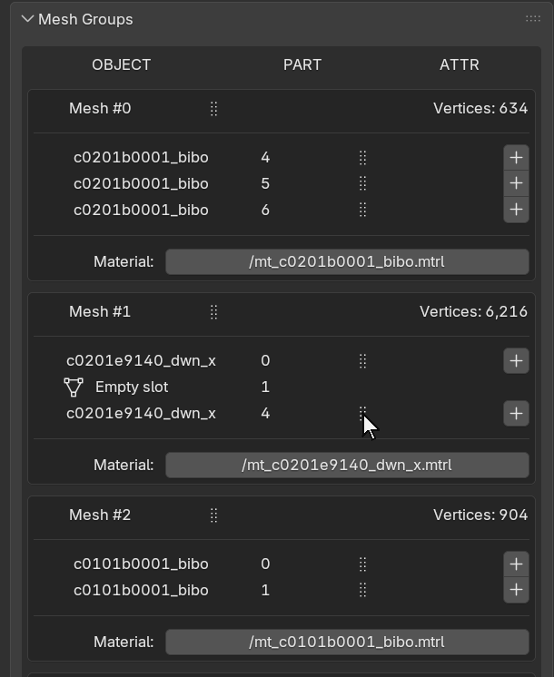
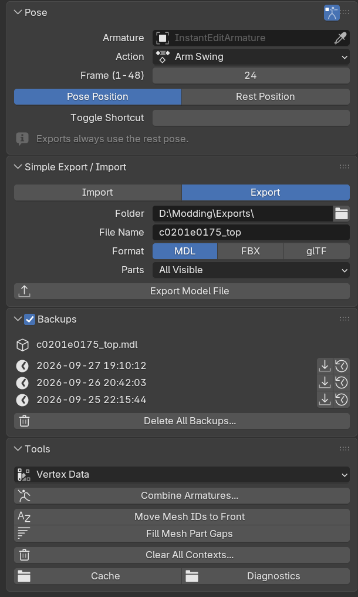
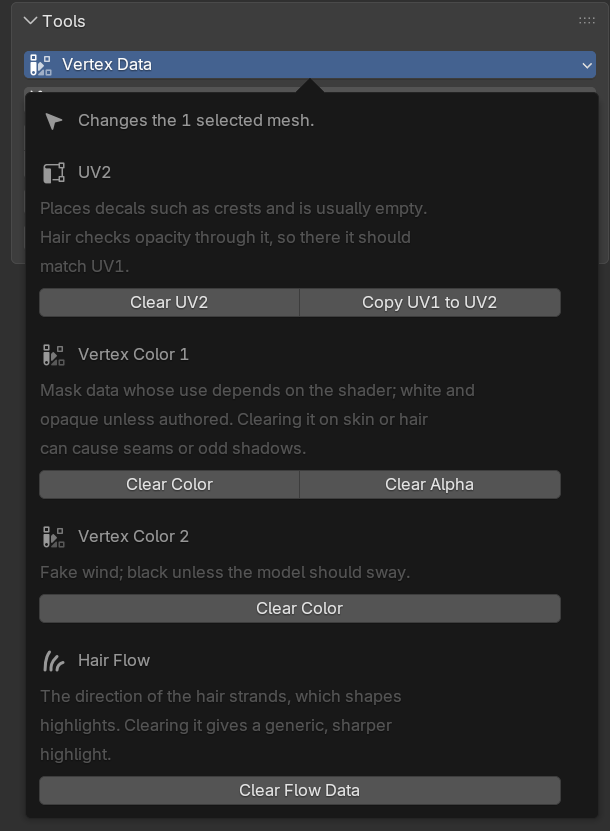
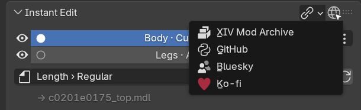

# XIV Instant Edit for Blender

The Blender half of [XIV Instant Edit](../README.md). The Dalamud plugin sends a model into
Blender, whether your character wears it, it's a file in a mod, or it's one of the game's own.
**Quick Export** writes your edit back into the Penumbra mod and redraws your character. Without
the plugin, the add-on still imports and exports MDL, FBX and glTF files.

## Requirements

- Blender 4.5 or newer, below 5.3. Blender 4.5 LTS and 5.2 LTS are tested.
- To edit models from the game: the XIV Instant Edit Dalamud plugin at the same version as the
  add-on, and Penumbra 1.7.1 or newer. Simple Export / Import works without them.

## Installation

The plugin's first-time setup, or **Settings > Blender add-on** in the plugin, installs the add-on
for you. Blender has to be closed while it does. To install it by hand:

1. In Blender, open **Edit > Preferences > Get Extensions**, then **Repositories > + > Add Remote
   Repository**.
2. Enter this URL and tick **Check for Updates on Startup**:

   `https://raw.githubusercontent.com/link-0402/XIV-Instant-Edit/main/Blender-Addon/blender_repo/index.json`
3. Find **XIV Instant Edit** in the list and click **Install**.

Keep the add-on and the plugin on the same version: other combinations aren't supported. Blender's
updater sometimes misses an update, so compare the versions before reporting a bug.

Everything is in the **IE - Instant Edit** tab of the 3D Viewport's sidebar (press **N**).

## Features

### Instant Edit: back to the game in one click

- Every model sent from the plugin is a **Context**, a collection that remembers the mod and file
  it came from. With several Contexts, the eye hides one and the radio button picks the one Quick
  Export writes back. The **⋮** button shows its source mod and paths.
- The export target: **In Place** (the imported file), another option of the mod, a new option or
  group, **Save as New Mod**, or **Create Mashup** when models from two or more mods are visible.
  A mashup is a new mod or group with the combined model and the materials and textures it needs.
- The panel lists anything that blocks or weakens the export, such as untriangulated meshes,
  vertices without bone weights or missing materials.
- **Quick Export** writes the model, sets up Penumbra, and redraws your character and its
  minions, mounts and summons. The gear next to it picks the meshes to export (all visible, all
  but one, or only the Context's collection) and can add a Penumbra attribute toggle group.
- Game files you edit go into a new mod the first time you export them.

 

### Mesh Groups

- One box per mesh group with its parts, attributes, material and vertex count, which warns as it
  nears the 65,536-vertex limit. Below them is the triangle count of the model and the selection.
- Click a part's name to select it (Shift-click adds or removes it). **+** adds an attribute, and
  clicking an attribute removes it. The material button sets the group's material path, with the
  materials of the model's other groups one click away.
- To reorder, click a part's or group's grip, move the pointer, and click again to drop it. The
  list shows the new order under the pointer; parts whose material doesn't match their group turn
  red.
- Right-click a part's name for **Generate Duplicate with Backfaces**, or for **Remove Hidden
  Vertices** on that part alone.
- New meshes join a group by name: `group.part Name`, for example `2.1 Collar`, as in Yet Another
  Addon. **Tools > Move Mesh IDs to Front** converts TexTools' `Collar 2.1` names.

 

### Pose, Simple Export / Import, Backups and Tools

- **Pose** shows an armature in any of its actions at the timeline's frame, or in its rest pose,
  for checking clipping or painting weights in a pose. Animations sent from the plugin's
  **Animations** tab arrive as actions: recordings of your character's live pose (bone physics
  included) or a mod's animation file.
- **Simple Export / Import** reads and writes MDL, FBX and glTF files without the plugin.
- **Backups**: tick the header box to keep a copy of a model before an export replaces it. The
  list imports or restores them.
- **Tools**: **Vertex Data**, like TexTools' Modify Model Vertices (clear UV2 or copy UV1 into it,
  clear vertex colors or their alpha, clear hair flow, on the selected meshes), **Remove Hidden
  Vertices** (deletes what no camera angle can see on the selected meshes, such as skin under a
  top; its redo panel chooses whether other visible meshes can hide them and how many rings of
  hidden vertices stay at the edges), **Combine Armatures**, the mesh naming helpers, **Clear All
  Contexts**, and the cache and diagnostics folders.

### Also

- Imported models get the game's skeleton as their armature: the race's rest pose and bone
  hierarchy, with your skeleton mods and the hair, face, headgear or top skeleton the model uses.
  Bones point along the game bone's Y axis, as in TexTools FBX exports and devkits.
- A character sent with the plugin's **Send my character to Blender** (Quick Actions) lands in one
  `XIV Instant Edit Character [name]` collection: one armature with the character's whole skeleton
  that every body model is bound to, each model in its own `Instant Edit [...]` collection so it
  still exports on its own, and weapons on armatures of their own, hung from the bone that holds
  them. A pose or animation sent with it is an action on that armature. Sending the character
  again replaces the collection; objects you added to it move to the scene.
- It arrives as the game draws it. Parts the game hides, such as a mod's other variants or skin
  under gear, come in hidden (`xiv_ie_game_hidden`) and still export with the rest of their
  model, so Quick Export keeps the model whole; delete a part to leave it out. The shape keys the
  game has on are turned on; exports write the model without them, since the game turns them on
  itself.
- Optional material previews, built from the materials and textures the game uses for the model,
  with colorsets, masks, normal maps and transparency. They are only for viewing: Quick Export
  doesn't write them, and changing them doesn't change the game.
- Hair weighted with Magic Fit's **Hair Weights** (version 1.20.0 or newer) carries the hair
  skeleton it was weighted to (`xiv_est_hair` and `xiv_est_race` on the mesh objects). Quick
  Export sets that skeleton as the hair's EST entry (Penumbra's Extra Skeleton Parameters) in
  every option of the mod that uses the model, for the tag's race only; the export options show
  "Sets hair EST entry". It warns when the parts disagree, the tag is another race's, or the model
  isn't hair. Exporting the hair without a tag takes back only the entries Quick Export set, and
  restoring a Quick Export backup restores its EST entries too. Simple Export never changes EST.
- SimpleHeels offsets: give a mesh part the attribute `heels_offset=0.15` with its **+** button,
  or turn on **Options > Export > Calculate Heels Offset**.
- Keyboard shortcuts for Quick Export and the rest pose toggle. They start without a key: set one
  in the Quick Export options, the Pose panel or the add-on preferences.

## Good to know

- Leave the `Instant Edit [...]` collections alone until you've exported: don't rename, move or
  delete them. Hiding one hides its Context, and deleting it removes the Context.
- Every export needs triangulated meshes (a Triangulate modifier counts) and a bone weight on every
  vertex; the export names the meshes to fix. Vertex groups that aren't bones are left out.
- Exports always use the rest pose. Meshes of one export may use different armatures; their bones
  are merged into one list.
- Blender listens for the plugin on local port 42424. While another program, such as a second
  Blender, holds it, Blender retries every few seconds; the port can be changed in the add-on
  preferences. The link icon in the **Instant Edit** header shows whether Blender is listening.
- Don't enable a custom Yet Another Addon build that has its own Instant Edit listener at the same
  time. The regular Yet Another Addon works alongside this add-on.
- The cache folder and its cleanup are set in the plugin's settings.

## Links

The globe at the right end of the **Instant Edit** header opens these pages:

- [Luci_xiv on XIV Mod Archive](https://www.xivmodarchive.com/user/124593)
- [XIV Instant Edit on GitHub](https://github.com/link-0402/XIV-Instant-Edit)
- [Bluesky](https://bsky.app/profile/xiv-luci.bsky.social)
- [Ko-fi](https://ko-fi.com/luci_xiv)

## Credits and license

Made by Luci_xiv.

- The model import and export and the mesh tools are derived from
  [Yet Another Addon](https://github.com/Arrenval/Yet-Another-Addon) by Arrenval.
- `xivpy` is a subset of [XIVPy](https://github.com/Arrenval/XIVPy) by Arrenval; its own credits
  are in `xivpy/README.md`.
- Material previews and Vertex Data follow how
  [xivModdingFramework](https://github.com/TexTools/xivModdingFramework) (TexTools) and
  [MeddleTools](https://github.com/PassiveModding/MeddleTools) read FFXIV materials and vertex
  data.

The add-on is licensed under the GNU General Public License version 3 or later. See `LICENSE`,
`xivpy/LICENSE` and `THIRD_PARTY_NOTICES.md`. It is an unofficial community tool, not affiliated
with or endorsed by Square Enix, Dalamud, Penumbra or the Blender Foundation.
