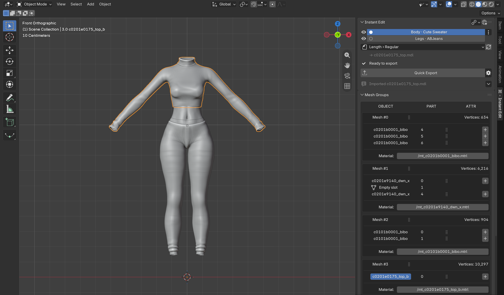

# XIV Instant Edit

Instant Edit is a Final Fantasy XIV Dalamud plugin that sends the models, textures and animations you see in game
straight into your editing software, and puts your changes straight back into your Penumbra mods, without manual
importing, exporting or file juggling. Model editing uses a Blender add-on, and works on vanilla game files as well as
Penumbra mods.



**The [wiki](https://github.com/link-0402/XIV-Instant-Edit/wiki) explains every feature step by step.**

## Features

- **Models in Blender**: send any on-screen or modded model to Blender with one click, then Quick Export it back in
  place, into another mod option, a new mod or a mashup of several mods. Imports come with the game's skeleton.
  [Guide](https://github.com/link-0402/XIV-Instant-Edit/wiki/Editing-a-Model-in-Blender)
- **Textures**: edit textures in Photoshop, GIMP, Krita, Paint.NET or any TGA editor, including variants as Penumbra
  options. [Guide](https://github.com/link-0402/XIV-Instant-Edit/wiki/Editing-Textures)
- **Substance Painter**: paint on the model with the exact textures your character uses and send them back to the game.
  Paint my skin, in Quick Actions, opens every body part that shows skin at once, and the face if you tick it, so
  tattoos and body paint can cross the wrists, waist, ankles and neck.
  [Guide](https://github.com/link-0402/XIV-Instant-Edit/wiki/Painting-in-Substance-Painter)
- **Animations**: bake LivePose adjustments into animations, repair their skeletons, give bones back to physics, and
  send animations or a recorded live pose to Blender.
  [Editing](https://github.com/link-0402/XIV-Instant-Edit/wiki/Editing-Animations) ·
  [In Blender](https://github.com/link-0402/XIV-Instant-Edit/wiki/Animations-in-Blender)
- **Game Files**: browse the game's own models, edit them, or batch-export their files and skeletons.
  [Guide](https://github.com/link-0402/XIV-Instant-Edit/wiki/Game-Files)
- **Quick Actions**: tasks for your whole character.
  - Fix the skin seams where its models meet: the face and body at the neck, and the top, gloves, legs and shoes at the
    wrists, waist and ankles. [Guide](https://github.com/link-0402/XIV-Instant-Edit/wiki/Fixing-the-Neck-Seam)
  - Compress its textures automatically: the uncompressed mod textures it wears are compressed as they load, so
    Lightless, PlayerSync and other sync plugins count less texture memory, unless a check finds they'd look different.
    The originals are backed up and can be restored.
  - Paint its whole skin in Substance Painter.
  - Measure the [Simple Heels](https://github.com/Caraxi/SimpleHeels) offset that keeps its heels from sinking into the
    ground.
  - Send it to Blender in one click: every model it shows on one armature with its skeleton, in its rest pose, the pose
    it stands in or the animation it plays, and each model still exports back on its own.
- **Racial scaling**: preview gear made for another race shaped for yours in Blender and Painter.
  [Guide](https://github.com/link-0402/XIV-Instant-Edit/wiki/Racial-Scaling)

## Requirements

- [XIVLauncher](https://goatcorp.github.io/) with Dalamud enabled
- [Penumbra](https://github.com/xivdev/Penumbra) 1.7.1.0 or newer
- [Blender](https://www.blender.org/) 4.5.0 or newer for model editing
- Optional: an image editor that saves 32-bit TGA files, [Substance 3D Painter](https://www.adobe.com/products/substance3d/apps/painter.html)
  10.0.1 or newer, and the LivePose plugin for animation editing

## Installation

1. In FFXIV, run `/xlsettings`, open **Experimental** and add this under **Custom Plugin Repositories**:
   ```
   https://raw.githubusercontent.com/link-0402/DalamudPlugins/main/repo.json
   ```
2. Save, open `/xlplugins` and install **XIV Instant Edit**.
3. Open it with `/ie`. The first-time setup picks a cache folder, then finds Blender, your image editors and
   Substance Painter and sets them up, including the Blender add-on.

To install the Blender add-on by hand, add this remote repository under **Edit > Preferences > Get Extensions >
Repositories** and turn on **Check for Updates on Startup**, so the add-on stays in step with the plugin:

```
https://raw.githubusercontent.com/link-0402/XIV-Instant-Edit/main/Blender-Addon/blender_repo/index.json
```

See [Installation and setup](https://github.com/link-0402/XIV-Instant-Edit/wiki/Installation-and-Setup) for details,
supported editor versions and manual setup, and the add-on's [README](Blender-Addon/README.md) for its sidebar.

## Credits and links

- The Blender add-on was initially derived from [Yet Another Addon](https://github.com/Arrenval/Yet-Another-Addon) and
  [XIVPy](https://github.com/Arrenval/XIVPy) by Arrenval; see [its credits](Blender-Addon/README.md#credits-and-license).
- The animation tools adapt code from [VFXEditor](https://github.com/0ceal0t/Dalamud-VFXEditor) by 0ceal0t and follow
  [LivePose](https://github.com/Caraxi/LivePose) by Caraxi; see [THIRD-PARTY-NOTICES.md](THIRD-PARTY-NOTICES.md).

## Contributing

Bug reports and feature ideas are welcome. To contribute code, see [CONTRIBUTING.md](CONTRIBUTING.md) for setup,
testing and submission guidance.

## License

This is an unofficial community tool and is not affiliated with or endorsed by Square Enix, Dalamud, Penumbra, or
Blender. The project is licensed under the [GNU GPL-3.0-or-later](LICENSE).
