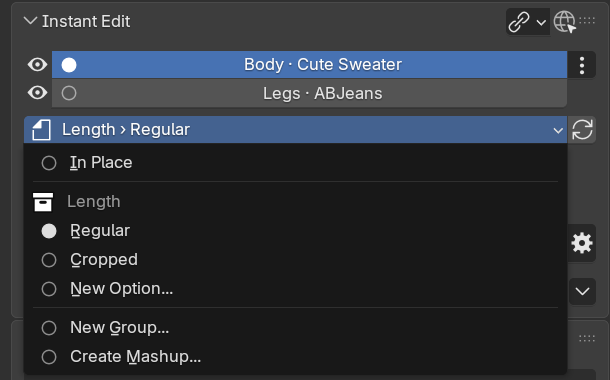

# XIV Instant Edit

Instant Edit is a Final Fantasy XIV Dalamud plugin that serves as a method of instantaneously moving vanilla game or mod resources into editing software and replacing those edited assets back into the game without requiring additional manual user import, export or setup work.
Model editing uses a Blender add-on to manage model life cycle and allows for exporting of both vanilla as well as modded Penumbra mod model files.
Additionally, it supports full software-independent texture editing as well as animation editing.

## Requirements

- [XIVLauncher](https://goatcorp.github.io/) with Dalamud enabled
- [Penumbra](https://github.com/xivdev/Penumbra) 1.7.1.0+
- [Blender](https://www.blender.org/) 4.5.0 or newer for model editing, up to the newest version the add-on
  lists as supported (currently anything below 5.3.0)
- (optional) an image editor that opens and saves 32-bit TGA files, for texture editing. Any such editor works;
  the first-time setup finds these and sets them up:

  | Editor | Versions | What setup installs |
  |---|---|---|
  | Adobe Photoshop | CC or newer, developed with Photoshop 2025. Not Photoshop Elements, which has no scripting. | The Save Flattened TGA scripts, into `Presets\Scripts` of Photoshop's install folder (Windows asks for administrator permission). They save 8 bits/channel documents only. |
  | GIMP | 2.10 and 3.x. GIMP 2.8 and older keep their settings elsewhere and aren't supported. | The Save Flattened TGA script, into `%APPDATA%\GIMP\<version>\scripts`. |
  | Krita | 5.x and 6.x | The Save Flattened TGA plugin, into `pykrita` in Krita's resource folder, enabled in `kritarc`. |
  | Paint.NET | Any desktop version | Nothing: it flattens TGAs itself. Choose 32-bit when saving. |

  The GIMP and Krita scripts haven't been tested in a live GIMP or Krita yet.
- (optional) [Adobe Substance 3D Painter](https://www.adobe.com/products/substance3d/apps/painter.html) 10.0.1 or newer,
  from Adobe or Steam (developed with 11.0.0), for painting textures on the model
- (optional) the LivePose Dalamud plugin for animation editing (baking pose adjustments)

Setup finds tools in their usual Windows install locations: the installed-apps list, Program Files, Steam libraries
and running programs. A Blender it doesn't find, such as one unpacked from a ZIP, can be added with **Add a Blender
that isn't listed**. Microsoft Store editions, and native Linux programs next to a Wine install of the game, aren't
found; set those up by hand (see [Install the Blender add-on](#install-the-blender-add-on) and
[Tools](https://github.com/link-0402/XIV-Instant-Edit/tree/main/Tools)).

Setup still lists versions outside these ranges, with the reason, but doesn't install into them: Blender outside the
add-on's range, GIMP before 2.10, Krita before 5 and Painter before 10.0.1. An older GIMP or Krita can still be picked
as the texture editor; save flattened TGAs by hand there.

## Installation

### Install the Dalamud plugin

1. In FFXIV, run `/xlsettings` and open **Experimental**.
2. Add this URL under **Custom Plugin Repositories**:

   `https://raw.githubusercontent.com/link-0402/DalamudPlugins/main/repo.json`

3. Enable the repository, save your settings, and open `/xlplugins`.
4. Find and install **XIV Instant Edit** under **All Plugins**.
5. When opened for the first time, run through the guided first-time setup. It asks for a cache location for
   temporary export files, then finds Blender, your image editors and Substance Painter on your PC and sets them up:
   - **Blender**: installs the add-on from this repository's extension repository (below), with **Check for Updates on
     Startup** turned on. Blender must be closed while it installs.
   - **Texture editor**: pick one of the editors found, or any program that saves TGA files. For Photoshop, GIMP and
     Krita it installs the Save Flattened TGA scripts (Photoshop asks for administrator permission, since its scripts
     folder is in Program Files).
   - **Substance Painter** (optional): turns on painting and installs the Painter plugin into the folder Painter reads
     plugins from.

   Everything but the cache can be skipped, and set up or updated later in Settings.

### Install the Blender add-on

The first-time setup and **Settings > Blender add-on** do this for you. To do it by hand:

1. Open **Edit > Preferences > Get Extensions** in Blender.
2. Click **Repositories**, click **+**, and choose **Add Remote Repository**.
3. Add this repository URL:

   `https://raw.githubusercontent.com/link-0402/XIV-Instant-Edit/main/Blender-Addon/blender_repo/index.json`
4. It is **Strongly recommended** to tick **Check for Updates on Startup** to receive automatic updates. 
   An out-of-sync version of the plugin and Blender add-on may lead to unexpected behavior and is not supported.
   Blender's automatic extension updater can be unreliable, please verify the versions match and are up-to-date before submitting issues.
5. Find **XIV Instant Edit** in the list and install it.

The add-on's own [README](Blender-Addon/README.md) describes everything in its sidebar.

## How to: Model Editing

1. Type /ie to open the plugin interface ingame. The on-screen list loads on its own; the refresh button in the toolbar reloads it.
2. Start Blender. Verify the toolbar shows Blender as "Online".
3. Verify the model options both in-game (the sliders button in the toolbar) and inside the add-on, then use the pencil action (or right-click, "Edit model in Blender") on the model you want to import. Hover a model for a summary and thumbnail before importing it.
4. Edit the model as you normally would.
5. In the add-on's **Instant Edit** panel, pick where the export goes. With several models in the scene, the radio
   buttons choose the one (the Context) to export, and the menu below them shows that model's mod:
   - **In Place** overwrites the exact model that you imported. This is the default.
   - An option of an existing group overwrites the model file that option uses. **New Option...** under a group
     adds an option to it; enter its name below the menu.
   - **New Group...** sets up a new option group in the mod you imported from and sets up the paths for you. Enter
     the group and option names below the menu.
   - **Create Mashup...** creates a new mod, or a new group in an existing mod, with the combined model and all the
     textures and materials it needs. It shows when models from two or more mods are visible in the scene;
     otherwise **Save as New Mod...** takes its place.

   
6. Press **Quick Export**. You'll immediately see the results in-game (if your character currently uses the model).

Hair weighted to one of the game's hair skeletons with Magic Fit's **Hair Weights** (1.20.0 or newer) remembers
that skeleton, and Quick Export sets it as the hair's EST entry (Penumbra's Extra Skeleton Parameters) in every
option of the mod that uses the model, for the race the skeleton belongs to. The panel warns when the hair's parts
name different skeletons, the skeleton belongs to another race, or the model isn't hair. Exporting the hair
without a skeleton takes back only the entries Quick Export set, never ones you set yourself, and restoring a
Quick Export backup restores the EST entries along with the model.

## How to: Texture Editing

1. Type /ie to open the plugin interface ingame.
2. Choose the **Textures** chip in **On Screen** or **Mod Browser**, then use the brush action
   (or right-click, "Edit texture") on a texture. Hovering a texture shows a preview first.
   For vanilla textures, enable **Include vanilla** and enter a new mod name.
3. Edit the opened TGA, and save that same file as **32-bit TGA with an 8-bit
   alpha channel**.
   Uncompressed and RLE TGA saves are supported. You can change the resolution
   (up to 8192 × 8192); compressed formats need a width and height divisible by 4.
4. After the save finishes, Instant Edit converts it to the original TEX format,
   replaces the mod file with a backup, reloads the mod, and redraws the selected
   actor and the local player/owned entities. A vanilla override is created and
   enabled in the captured collection on the first changed save. To save
   uncompressed instead, turn off **Recompress saved textures** in the toolbar's
   options popover.
5. To make variants, save a copy of the TGA under another name in the same folder
   (for example `Red.tga`). Instant Edit writes it next to the original TEX, adds it as
   an option named after the file to a `<texture> variants` group in the mod, and
   selects that option in the captured collection. The group's **Original** option shows
   the edited texture; saving the main TGA switches back to it. Saving a variant again
   updates it.
6. Sessions pause when the game or plugin restarts. Opening the texture again
   (or the open action on its card in **Sessions**) resumes it.

Note that textures must be saved as a flattened TGA file. You can either do so manually or use the Save Flattened TGA scripts for Photoshop, GIMP and Krita: the first-time setup and **Settings > Texture editing** install them into the editors they find, and they're also in [Tools](https://github.com/link-0402/XIV-Instant-Edit/tree/main/Tools) for installing by hand. Other image editing software might not support similar scripts or already saves a flattened copy with the usual Ctrl + S shortcut (Paint.NET does).

## How to: Texture painting in Substance Painter

1. In Settings (or the first-time setup), tick **Paint textures in Substance Painter** and press **Install Painter plugin**.
   Instant Edit finds Painter itself (Adobe or Steam installs) and installs the plugin into the plugin folder Painter's
   log names, which is normally `Documents\Adobe\Adobe Substance 3D Painter\python\plugins`.
   Then start Painter and enable it once under **Python > xiv_instant_edit**. Whenever Settings
   offers **Update Painter plugin**, press it and restart Painter.
2. In **On Screen**, use the paint-roller action (or right-click, "Paint textures in Substance
   Painter") on a model. This only exists in On Screen: it uses exactly the materials and
   textures your character renders, including skin and texture-only mods.
3. The dialog lists each material and its textures. Ticked textures are sent back; the others
   stay in Painter for reference, with the reason shown (for example shared game textures).
   Models that share a material, such as the body parts sharing your skin texture, can be
   added so you can paint across them. For vanilla textures, enter a name for the new mod.
4. **Send to Painter** opens the project in Painter, starting it if needed. Each material is a
   texture set, and the current textures are its bottom **XIV original** layer. Painter's
   channels follow each shader: base color, normal, opacity, roughness, specular level and AO
   where they fit, and labelled user channels for the rest. Paint on layers above it.
   The project shows what your character draws: parts turned off by gear or mod options stay
   out, see-through materials (lashes, brows, lace) are transparent, non-square textures keep
   their proportions, and hair and colorset gear show their in-game colors.
5. Press **Send to game** in Painter's **XIV Instant Edit** panel. The textures go back
   through texture sessions (with backups and the original compression), and the game
   reloads and redraws once. Textures you haven't changed are left alone, and undoing all
   changes in Painter restores the original file exactly. Painter's own save and export
   are not changed.
6. Save the Painter project wherever you like. Reopening it later links it again; the project
   is listed under **Sessions**, where it can also be discarded.

Where a texture is also used by meshes outside the project, only the areas under this
project's UV islands are taken from Painter, so fill layers can't overwrite the rest.

## How to: Animation Editing

Animation editing needs the LivePose plugin. It rebakes a character animation so that
LivePose adjustments become part of the animation itself, repairs animations whose
skeleton no longer matches the character, or removes bones from an animation to hand
them back to physics.

1. Open the **Animations** tab and play the animation (an emote, idle or movement)
   on your character. It appears in the list at the top, laid out like the On Screen
   list: the animation with its startup, the mod it comes from and its file. Animations
   played earlier stay listed below it.
2. Select it. The tabs below hold its tools. **Source** shows the file, the live skeleton
   and the source skeleton the animation was made for; pick one if several candidates
   match. Source skeletons come from a library of every skeleton in your mods, built once
   and saved in the cache folder. After installing, updating or removing skeleton mods,
   use **Rebuild skeleton library** in Settings.
3. Pick the tab for the edit:
   - **LivePose**: tick the bones and components of your LivePose adjustments, then
     **Rebake with LivePose**.
   - **Animated bones**: untick bones the animation should stop driving, then
     **Rebake without unticked bones**. Unticked bones are left out of the other
     rebakes too.
   - **Skeleton repair**: **Repair skeleton** retargets the animation onto your live
     skeleton, for example after a skeleton mod inserted bones.

   Each of these tabs ends with the choice of a new mod or an in-place replacement.
4. Every edit is journaled for a week. **Undo last edit** reverts it and restores the
   live offsets it cleared. The **Recent edits** tab lists older edits and shows a count
   when an interrupted edit needs attention.

## How to: Animations in Blender

The **Animations** tab sends animations to Blender as a new action on your scene
armature, named under **Animation export** in the toolbar's options popover. Without an
object of that name, Blender uses the active armature, or the scene's only one. Bones are
matched by name, so use the FFXIV skeleton your meshes are weighted to, such as the
armature a model sent from the plugin comes with, which has the game's rest pose. LivePose
is not needed.

- **Record live pose**, a tab at the right of the Animations tab, records a character's
  skeleton on every frame, the way the game renders it: the animation plus bone physics,
  Customize+ and LivePose. Use it to check clothing for clipping in motion, for example
  while walking; the countdown gives you time to start moving. In GPose, **You** is your
  posed copy and **Current target** is the GPose target, such as an actor Brio plays an
  animation on. Recordings are sampled at 60 frames per second.
- **The pen button** of an animation in the list (or right-click, "Send animation to
  Blender") samples its file at its own frame rate on the skeleton it was made for. Physics
  bones keep their rest pose.
- **Animation files in the Mod Browser**: the **Animations** filter lists a mod's character
  animation packs (`.pap`). The pen button (or right-click, "Send animation to Blender")
  opens a dialog to pick the clip, since a pack often holds a loop and its start, and the
  skeleton it was made for, found from your skeleton mods and the pack's race. Nothing has
  to play in game.

Blender keys the animation at the scene's frame rate, starting at the scene's start frame,
and moves the scene's end frame to its last frame; set the scene to 60 fps to keep every
recorded sample. Each bone receives the game bone's movement relative to its reference
pose, turned into the bone's own rest orientation, so armatures imported with other bone
orientations (glTF, FBX) work. Bones the armature lacks are listed in the result. Bone
scale is only keyed with **Key bone scale** on, so Customize+ scaling applied in Blender
stays in place.

## How to: Game Files and exports

The **Game Files** tab lists the game's own models, independent of what your character wears:
every hairstyle, face, tail, Viera ear and body of every race, and all equipment, accessories and
weapons. The first time you open a category it scans the game's file index, which takes about a
second. Gear and weapons are named after the items that use them, and hairstyles after the item
that unlocks them.

1. Pick a category on the left. Filter by race (player races are shown by default) and slot, or
   search item names, IDs, races and paths. For hair, **Player-selectable only** hides the styles
   only NPCs wear. For faces, **Player races** shows only the faces players can pick in character
   creation; the NPC-only faces in the player race folders are under **NPC races**.
2. Open a model with its arrow to see its materials, their textures and the skeleton files the game
   loads for it. Hovering shows the same previews as elsewhere.
3. Edit a model in Blender with the pencil, or a texture with the brush, as in the other tabs. The
   first change to a game file goes into a new mod enabled in your collection.
4. To export files, tick models (shift-click ticks a range, and the checklist button next to
   **Export selected** ticks every shown model) and press **Export selected**. Choose a folder and
   what to include. The folder starts out as `game-exports` in the cache folder (**Default** goes
   back to it); the rest of the cache folder, Penumbra's mod folder and the game's folder are
   refused.
   - **Materials**, and for gear and weapons the IMC file that picks their variants;
     **Every material variant** adds the other dye and colour versions.
   - **Textures**, as the game stores them.
   - **Skeleton files**: the race's body skeleton and the hair, face, headgear or top skeleton the
     game's EST table picks for the model, plus those tables. A hairstyle's skeleton number can
     differ from its own; hair 113 of Male Midlanders uses skeleton h0114.
   - **Decoded skeletons**: next to each skeleton file set, a `.skeleton.json` with the body and its
     partial skeleton merged, in the format the Blender add-on's `instant_edit/skeleton.py` reads.
     The game decodes one skeleton per frame, so large exports take a minute.

Files are written at their game paths under the folder, so a file several models use is written
once. `instant-edit-export-<date>-<time>.json` in the folder lists every model with its race, IDs,
item names, materials, textures and skeleton files (with the EST entry that picked them), and any
model that could not be exported. Exports run in the background and can be cancelled; the manifest
is written either way. For example, all player hairstyles: choose **Hair**, keep **Player races**,
tick all shown models and export.

With **Automatic cache cleanup** on (Settings), files in the cache's `game-exports` folder that no
export has written for 7 days are removed, and so are the folders that leaves empty. Exporting a
model again renews its files. Choose a folder outside the cache to keep exports.

## Additional notes

The plugin window has a toolbar with the tabs, Penumbra and Blender status dots, a
refresh button and an options popover; the gear in the title bar opens Settings, where
automatic refresh, notifications and model thumbnails can be turned off. The status
strip at the bottom keeps the latest message per tab and a history of recent messages.

The Blender add-on keeps track of where each model came from through the automatically created "Instant Edit [context_id]" collections. To ensure the add-on works properly, do not move, rename, delete or otherwise edit these collections until you have exported the model you were working on. Hiding a collection from the viewport hides its context as well. To remove an old context and continue other work in the same scene, delete its collection.

### Main Features
- One-click import of models through an on-screen browser or simplified mod file browser.
- A browser for the game's own models, with batch export of their files, skeletons and a manifest to a folder.
- Hover previews for textures (with alpha), materials (their texture slots) and models (mesh, material and attribute summary with a rendered thumbnail).
- The on-screen list follows Penumbra: it refreshes when mod settings change or characters are redrawn, and rows offer copy, open folder, Open in Penumbra and Show in Mod Browser.
- Easy export context selection. Export in-place, pick any existing mod option or easily create a new one. The plugin sets up everything for you automatically.
- Instant creation of mashups. The plugin automatically sets up all required textures, materials and paths for you.
- Hair weighted with Magic Fit's Hair Weights gets the matching EST entry (hair skeleton) in Penumbra on export.
- Seamlessly integrates into any existing Blender scene, independent of body, devkit, etc.
- Simple Importer / Exporter for general FBX and MDL files with various QoL functions and automations optimized for FFXIV workflows
- One-click import and export for textures
- Texture painting in Substance Painter from On Screen, with one-click sending back to the game
- Animation editing: bake LivePose adjustments, repair skeletons, exclude bones, with undo and recovery
- Animations in Blender: record a character's live pose including bone physics, or send an animation your character plays or any mod's animation file, as an action on your armature

### Material preview

The optional texture import uses the effective MTRL and TEX files resolved for the
selected model and packs the generated images into the Blender file. It is a
practical Principled BSDF approximation, not an exact reproduction of FFXIV's
shader pipeline. Character gear is composed from its colorset, index, normal,
mask, and (in compatibility mode) diffuse textures, including colorset
roughness, metalness, and emission. Transparency follows each material's own
settings: translucent materials such as sheer fabric blend, while others cut
out at the material's alpha threshold. Missing or unsupported
resources keep the existing colored placeholder and produce a warning without
blocking model import. Note that the texture import is for preview purposes only.
Making changes to them in Blender will not affect the exported model.

## Credits and links

XIV Instant Edit is made by Luci_xiv:
[XIV Mod Archive](https://www.xivmodarchive.com/user/124593) ·
[Bluesky](https://bsky.app/profile/xiv-luci.bsky.social) ·
[Ko-fi](https://ko-fi.com/luci_xiv). The Blender add-on links to the same pages from the globe icon in its
**Instant Edit** panel.

- The Blender add-on is derived from [Yet Another Addon](https://github.com/Arrenval/Yet-Another-Addon) and
  [XIVPy](https://github.com/Arrenval/XIVPy) by Arrenval; see [its credits](Blender-Addon/README.md#credits-and-license).
- The animation tools adapt code from [VFXEditor](https://github.com/0ceal0t/Dalamud-VFXEditor) by 0ceal0t and follow
  [LivePose](https://github.com/Caraxi/LivePose) by Caraxi; see [THIRD-PARTY-NOTICES.md](THIRD-PARTY-NOTICES.md).

## Contributing

Bug reports and feature idea submissions are welcome.
If you'd like to contribute to this project, see [CONTRIBUTING.md](CONTRIBUTING.md) for setup, testing, and submission guidance.

## License

This is an unofficial community tool and is not affiliated with or endorsed by
Square Enix, Dalamud, Penumbra, or Blender. The project is licensed under the
[GNU GPL-3.0-or-later](LICENSE).
